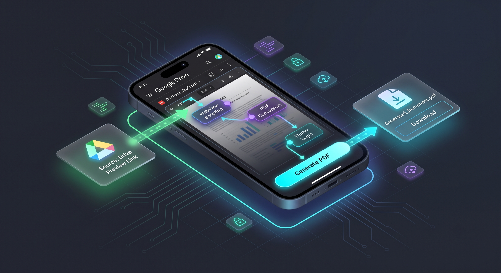

# GDocUnblocker

> ⚠️ **Status: currently non-functional.** Google changed how PDF pages are fetched in Drive previews; downloads no longer work. No ETA for a fix. Kept public as an educational Flutter / WebView case study.

Flutter app that attempted to save restricted Google Drive Doc/PDF previews by injecting scripts in a WebView and posting page images to a local `shelf` server on-device.



## Overview

`webview_flutter` cannot download Drive-restricted PDFs directly. This app opened the preview, captured pages as images via injected JavaScript, and POSTed them to `localhost:8080` so files could be written to device storage and opened from an in-app Downloads screen.

**Promo video (historical):** [YouTube](https://www.youtube.com/watch?v=lD80-iX3zTs)

## Links

- **Repo:** https://github.com/MS-Jahan/GDocUnblocker
- **Video:** https://www.youtube.com/watch?v=lD80-iX3zTs
- **Live demo:** none — app does not work against current Google Drive PDF previews

## Key Features (as designed)

- WebView integration with multiple unblock/capture methods
- On-device local server (`shelf`) to receive file POSTs
- Downloads page to browse/open saved files
- Storage permission handling (including manage-external-storage on Android)

## Tech Stack

**Flutter / Dart** · `webview_flutter` · `shelf` · `permission_handler` · `path_provider` / `android_path_provider` · `flutter_downloader` · `device_info_plus`

## Dependencies

From `pubspec.yaml` (run `flutter pub get`):

- `webview_flutter`, `flutter_custom_tabs`
- `shelf`, `permission_handler`
- `flutter_downloader`, `path_provider`, `android_path_provider`
- `device_info_plus`

SDK constraint: Dart `>=3.4.3 <4.0.0`

## How to Run Locally (for study / future fixes)

Prerequisites: [Flutter SDK](https://flutter.dev/docs/get-started/install), Android SDK.

```bash
git clone https://github.com/MS-Jahan/GDocUnblocker.git
cd GDocUnblocker
flutter pub get
flutter run
```

### Historical usage (when it worked)

1. Paste a Google Drive PDF preview URL.
2. Choose “Faster (Recommended)” or “Slower, Low Res”.
3. Open WebView → **Generate PDF** → file saved via local server → view under **Downloads**.

## How It Worked

1. Open Drive preview in WebView; inject capture scripts.
2. Local server on `localhost:8080` receives POSTed page/image data.
3. Save into device download directory; refresh Downloads UI.

## License

[MIT](LICENSE)
